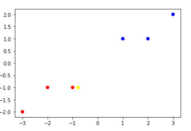
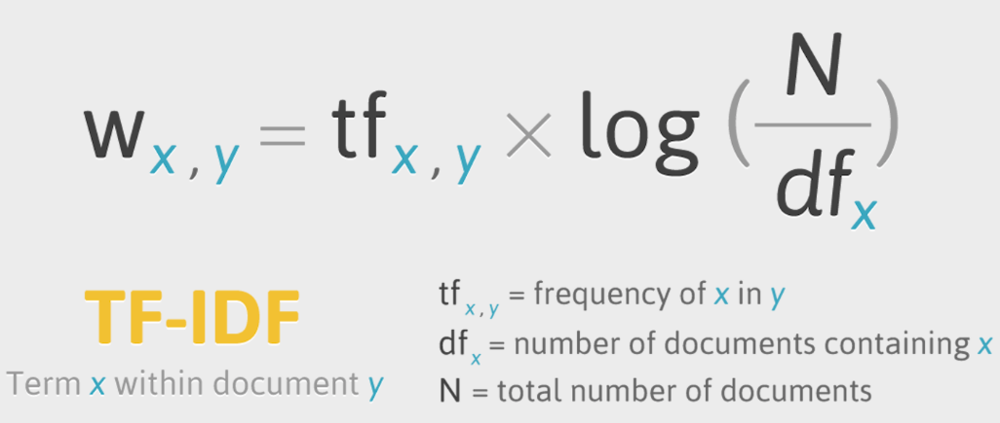

# NLP_Basic

## 초기세팅

```python
import numpy as np
from sklearn.naive_bayes import GaussianNB
from sklearn.metrics import accuracy_score
from sklearn.feature_extraction.text import CountVectorizer
from sklearn.feature_extraction.text import TfidfVectorizer
from sklearn.metrics.pairwise import cosine_similarity
from sklearn.linear_model import SGDClassifier
from sklearn.svm import LinearSVC
from tensorflow.keras.datasets import imdb ## 자연어 처리를 위한 DB
from konlpy.tag import Twitter #한글 언어 패키지
from konlpy.tag import Okt
from konlpy.tag import Kkma 
from konlpy.tag import Twitter
from pprint import pprint
import nltk ## 영어, 일반적인 언어 패키지
from nltk.classify.scikitlearn import SklearnClassifier
from wordcloud import WordCloud, STOPWORDS 
from gensim import corpora, models #일반적인 자언어 패키지
import numpy  as np
from PIL import Image
from wordcloud import ImageColorGenerator
import glob
import re
import matplotlib.pyplot as plt
from tensorflow.keras.preprocessing.text import Tokenizer
from tensorflow.keras.preprocessing.sequence import pad_sequences
%matplotlib inline
```

```bash
pip install gensim #문제없이 설치 가능   (단어를 벡터로 할때)
pip install konlpy # 윈도우에서 설치시 의존성 문제 발생할수 있음 (한국어 형태소)
pip install wordcloud # 윈도우에서 설치시 의존성 문제 발생할수 있음 (단어 시각화)
pip install jpype1 (리눅스에서) #konlpy 의 의존적인 라이브러리
conda install -c conda-forge jpype1(윈도우)
------------------------- 문제 없이 설치됨
pip 설치시 permission 에러 발생하면 뒤에--user 적어주면됨
```


각각의 캐릭터의 분포도를 구해서 특정 코드의 빈도수를 계산한다.

```python
x_train[0] # 0~54620 값들이 있다  # ko_str
print(np.where(x_train[0] >0)) ## np.where 을 사용하여 0 삭제, 이값들은 인덱스 값들이다.
index = np.where(x_train[0] >0)
data = x_train[0]
print(data[[32,46,44163]])
print(data[index]) ## for 문을 사용하지 않고 슬라이싱을 통해서 값 호출
```

```python
#X = np.array([[-1, -1], [3, 2]])
#Y = np.array([1,  2])

X = np.array([[-1, -1], [-2, -1], [-3, -2], [1, 1], [2, 1], [3, 2]])
Y = np.array(['r','r','r','b','b','b'])


color = [ 'red' if y == 'r' else 'blue' for y in Y]

plt.scatter(X[:, 0], X[:, 1], color=color)

t = np.array([[-0.8, -1]])

plt.scatter(t[:,0], t[:,1], color='yellow')
```



```python
# 학습하기 --- (*6)
clf = GaussianNB() 
clf.fit(x_train, y_train)
y_pred = clf.predict([count_codePoint('안녕')])
print(y_pred)
------------------
['ko']
```

```python
# 평가 전용 데이터 준비하기
ko_test_str = '안녕 어디야' ##### ㅁㅇㅁㄴ자음으로 만 적으면 일본어로 인식하는 단점이있다
ja_test_str = 'こんにちは'
en_test_str = 'Hello'
x_test = [count_codePoint(en_test_str),count_codePoint(ja_test_str),count_codePoint(ko_test_str)]
y_test = ['en', 'ja', 'ko']

# 평가하기 --- (*7)
y_pred = clf.predict(x_test)
print(y_pred)
print("정답률 = " , accuracy_score(y_test, y_pred))
```


다량의 데이터로 학습시켜 보기

```python
# 학습 데이터 준비하기 --- (*1)
x_train = []
y_train = []
for file in glob.glob('./language/train/*.txt'):
    # 언어 정보를 추출하고 레이블로 지정하기 --- (*2)
    print(file)
    y_train.append(file[17:19]) ## [17:19] 이거는 파일 이름이 ko,es,en 등으로 되어있어서 파일이름을 슬라이싱 하는 것이다.
    
    # 파일 내부의 문자열을 모두 추출한 뒤 빈도 배열로 변환한 뒤 입력 데이터로 사용하기 --- (*3)
    file_str = ''
    for line in open(file, 'r', encoding='UTF8'):
        file_str = file_str + line
    x_train.append(count_codePoint(file_str))
```

```python
# 학습하기
clf = GaussianNB() 
clf.fit(x_train, y_train)
```

```python
# 출력
y_pred = clf.predict([count_codePoint('Großkatzen')])
print(y_pred)
-------------------------
['de']
```


## 단어 빈도수 기반 자연어 처리

```python
corpus = [ 'you know i want your love',
         'i like you',
         'what should i do',
         'what']
stn = " ".join(corpus)
stn = stn.split(' ')
print(stn)

freq = {}
for i in stn:
    freq[i] = freq.get(i,0)+1
    
print(freq)
-------------------------------------
['you', 'know', 'i', 'want', 'your', 'love', 'i', 'like', 'you', 'what', 'should', 'i', 'do', 'what', 'should', 'should', 'what']
{'you': 2, 'know': 1, 'i': 3, 'want': 1, 'your': 1, 'love': 1, 'like': 1, 'what': 3, 'should': 3, 'do': 1}
```

```py
vector = CountVectorizer() 
tf = vector.fit_transform(corpus) ## 원핫인코딩을 해주는 함수
print(tf)
print(tf.toarray()) ## 단어수에 따라 1를 표현하는데 단어길이가 1개인경우 0으로처리
					## 값은 vocabulary_ 인덱스로 확인
-----------------------------------------------------
  (0, 7)	1
  (0, 1)	1
  (0, 5)	1
  (0, 8)	1
  (0, 3)	1
  (1, 7)	1
  (1, 2)	1
  (2, 6)	1
  (2, 4)	1
  (2, 0)	1
  (3, 6)	1
  (3, 4)	1
  (4, 6)	1
  (4, 4)	1
[[0 1 0 1 0 1 0 1 1]
 [0 0 1 0 0 0 0 1 0]
 [1 0 0 0 1 0 1 0 0]
 [0 0 0 0 1 0 1 0 0]
 [0 0 0 0 1 0 1 0 0]]
```

```python
print(vector.vocabulary_) # 각 단어의 인덱스가 어떻게 부여되었는지 보여준다.
{'you': 7, 'know': 1, 'want': 5, 'your': 8, 'love': 3, 'like': 2, 'what': 6, 'should': 4, 'do': 0}

```

단어를 벡터화 시키면 유사도의 거리와 분포를 구할수 있다.

```python
words = vector.get_feature_names() # 순서대로 정렬되어있음
for word in words: print(word)

print('===============')    
for key in vector.vocabulary_: # 순서는 랜덤으로 지정되어있다.
    print(key)
    
do
know
like
love
should
want
what
you
your
===============
you
know
want
your
love
like
what
should
do    
```


* TF-IDF
    * TF: 현재 문서에서 단어 A가 나타난 횟수(단어빈도수)  
    * DF: 단어가 나타난 문서의 수( 다른 문서에서 언급횟수)
    * 특정 단어의 상대적인 빈도를 나타내주는 값
    * 값이 클 수록 내 문서에만 많이 언급되는 단어(=다른 문서에서는 잘 언급 안됨)
    * 값이 작을수록 다른 문서에 잘 언급하는 단어를 의미(=현재 문서와 관련없음)
    

 IDF 는 특정 문서에서 언급이 높을 경우에 높다. (DF 와 반비례)

